### 9. From HMC to NUTS: Automating the Hamiltonian

[In the previous post](https://lab.embedinker.com/posts/monte-carlo-simulations-volatility-model/) we visited the (simplified) version of a Bayesian estimator of the $GARCH(1,1)$ volatility model parameters distributions using the Hamiltonian Monte Carlo technique. We suggested then, that implementing the No U-Turn Sampler (NUTS) would provide an added bonus of better convergence and faster run times. This article serves as the second part of that series - and will number the sections accordingly.


### 10. The "U-Turn" Concept
Imagine the sampler is a particle sliding on a landscape. NUTS keeps track of the distance between the starting position ($\theta_{start}$) and the current position ($\theta_{current}$). 

As long as the particle is moving away from the start, it's exploring new territory. However, if the trajectory curves back such that the dot product of the momentum vector and the distance vector becomes negative:
$$\text{Momentum} \cdot (\theta_{current} - \theta_{start}) \lt 0$$
...it means the particle has started to "U-Turn." At this point, NUTS stops the simulation because further steps would just bring us back toward where we began.

#### 10.1. How it works: The Recursive Tree
NUTS doesn't just go forward and then backward linearly. It builds a **binary tree** of leapfrog steps. Here is the conceptual process:

1.  **Initial Step:** Start with one leapfrog step (either forward or backward).
2.  **Doubling:** NUTS recursively doubles the path length ($1 \to 2 \to 4 \to 8 \dots$).
3.  **Random Expansion:** At each doubling step, it randomly chooses to expand either **forward** in time or **backward** in time from the current segment.
4.  **Checking for U-Turns:** After every expansion, it checks the endpoints of the new path. If any endpoint shows a "U-Turn" relative to the other endpoint, the recursion stops.
5.  **Sampling:** Once the tree is finished (and a U-Turn is detected), NUTS doesn't just take the last point; it **randomly samples one state from all the points generated in that tree**.

#### 10.2 Why this is better for GARCH
For GARCH models, the "energy landscape" can be very narrow and curved (especially because $\alpha$ and $\beta$ are highly correlated). 

*   **Standard HMC:** We would have to spend hours tuning $L$ and $\epsilon$. If we pick an $L$ that works for $\omega$, it might be too long for $\beta$.
*   **NUTS:** It adapts the path length for every single iteration. In "flat" areas of the posterior, NUTS will take many steps to explore. In "tight" curves, NUTS will detect a U-Turn quickly and stop, preventing the sampler from wasting cycles.

#### 10.3 High-Level Pseudo-code Logic
For a C++ implementation, the high level logic looks like this:

```cpp
// Conceptual NUTS loop
while (sampling) {
    momentum = sample_normal();
    theta_start = current_theta;
    
    // Build the tree recursively
    Tree node = build_tree(theta_start, momentum, depth=0);
    
    // The "No-U-Turn" check happens inside build_tree:
    // if (dot_product(momentum, theta_end - theta_start) &lt; 0) return stop;

    // Sample a point from the tree based on slice sampling or multinomial logic
    current_theta = sample_from_tree(node);
}
```
### 11. Summary: Comparison for Implementation

| Feature             | Standard HMC             | NUTS                              |
| :------------------ | :----------------------- | :-------------------------------- |
| **Path Length $L$** | Fixed (User-defined)     | Dynamic (Automatic)               |
| **Trajectory**      | Linear line              | Recursive Binary Tree             |
| **Stopping Rule**   | After $L$ steps          | When it starts returning to start |
| **Complexity**      | Easy to code             | Higher (tree management, slice sampling) |
| **Efficiency**      | Medium (requires tuning) | High (Gold standard)              |

### 12. Results

#### Price
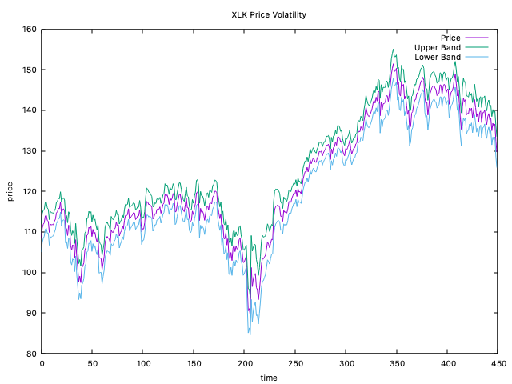
Although not checked thoroughly - the volatility bands appear to be slightly tighter over the same historical candles.

#### Volatility plot 

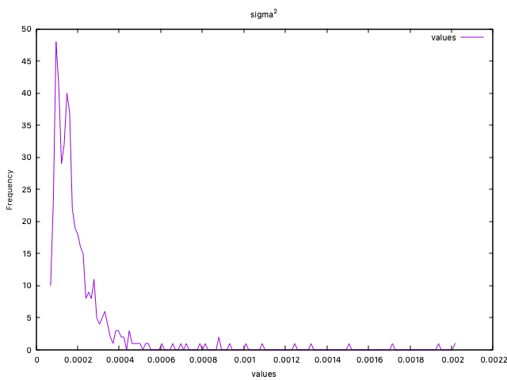

#### Posterior distributions

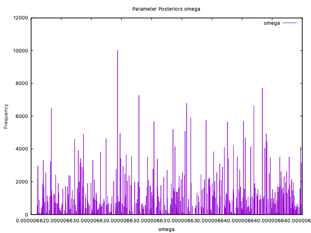
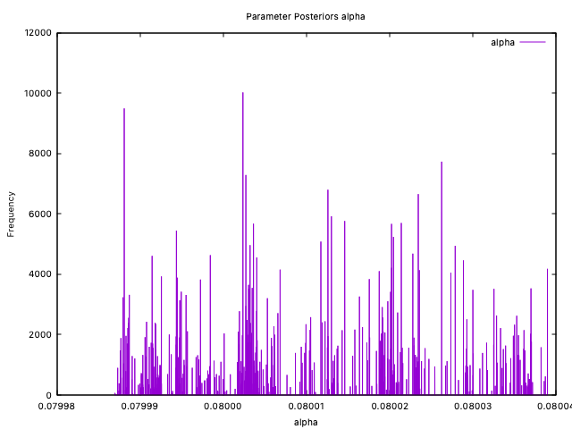
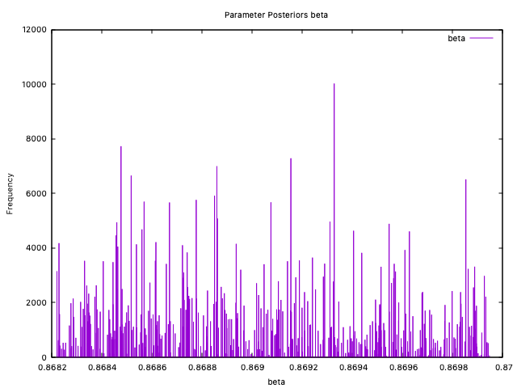

#### Phase Plots

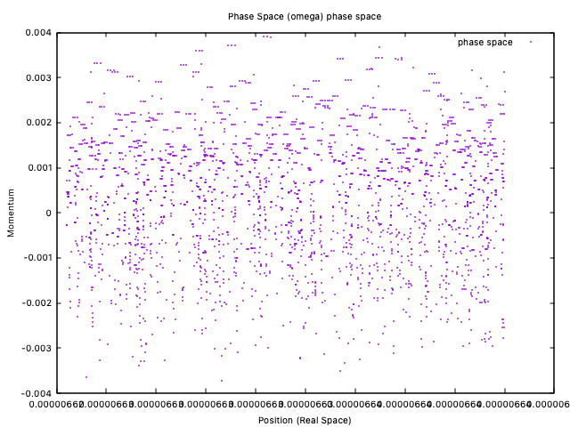
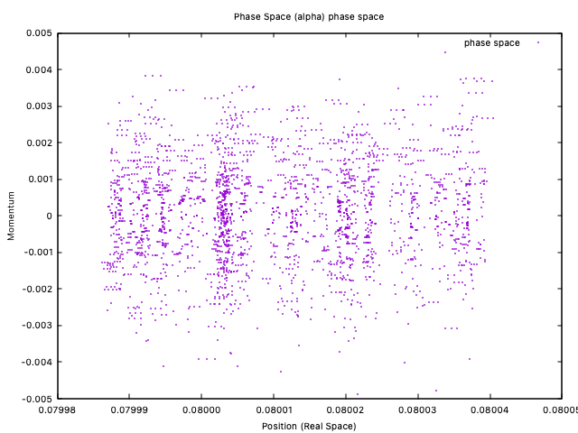
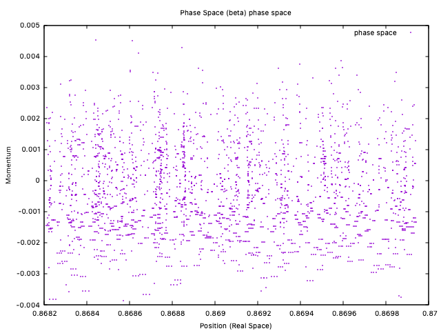

#### Chain Plots - convergence illustrated
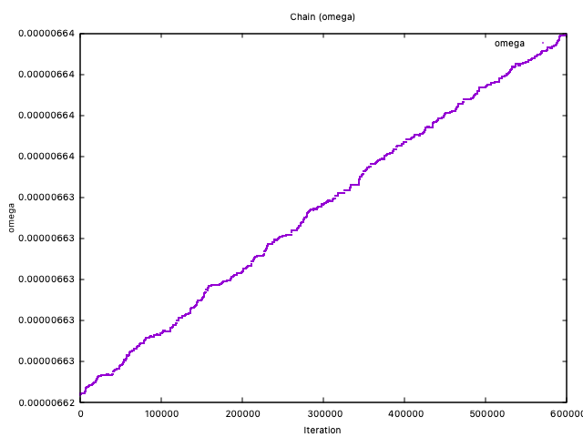
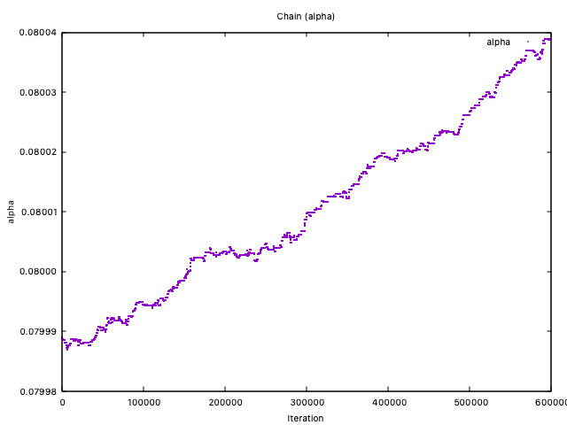
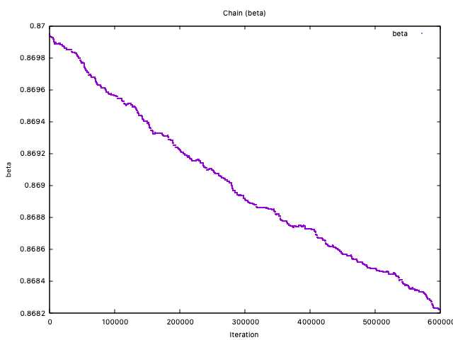

### Price volatility time variation
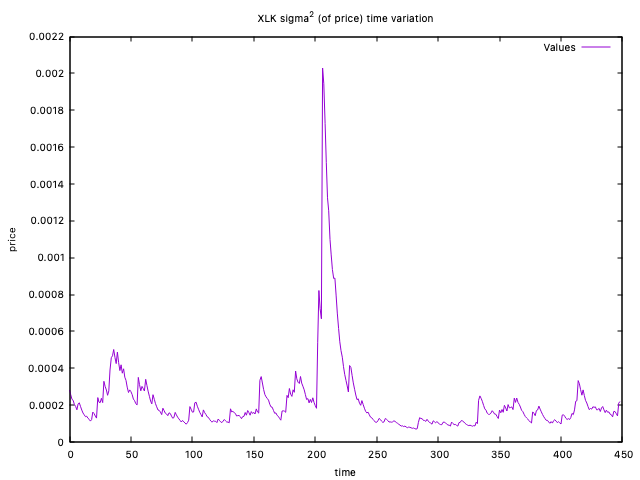


### 13. Comments
Questions or suggestions? [Send me an email](mailto:razvan@embedinker.com) 