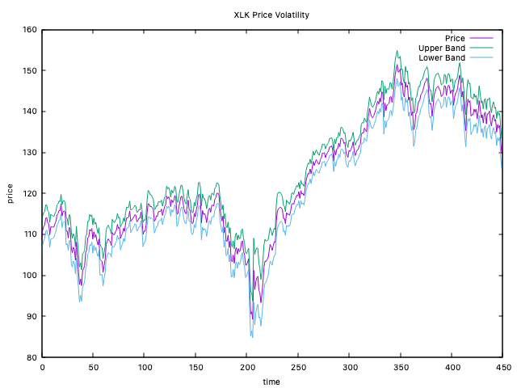
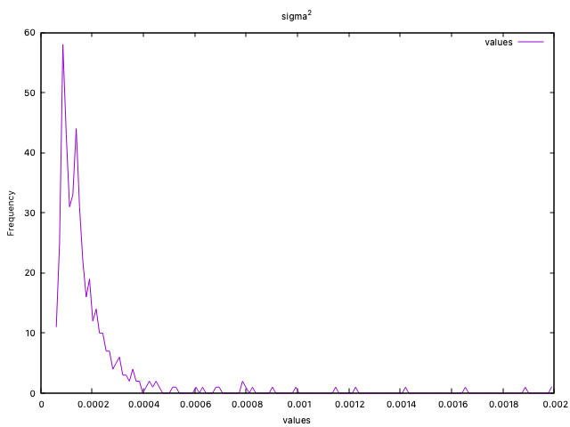
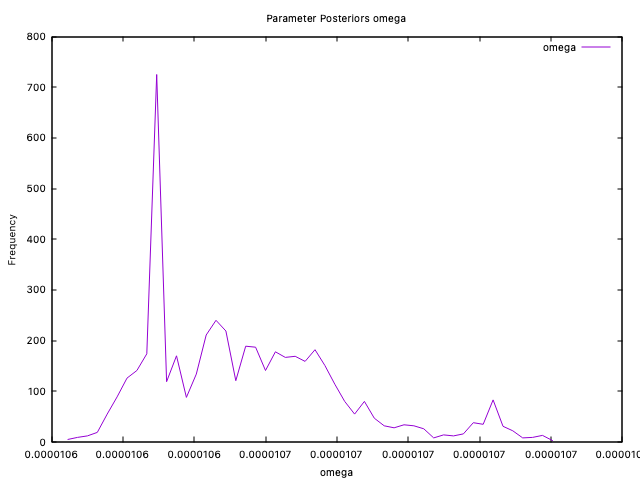
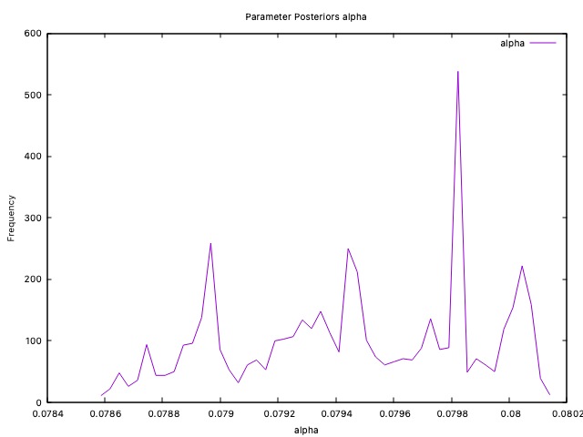
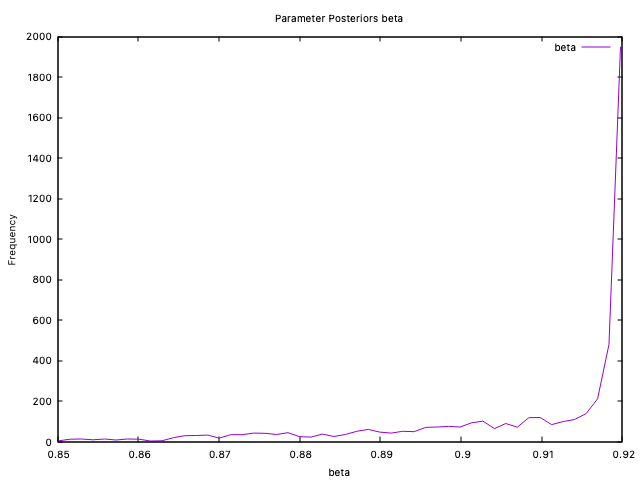
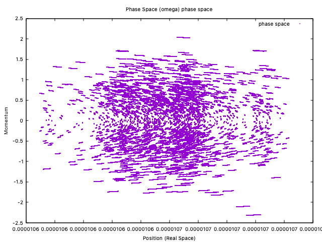
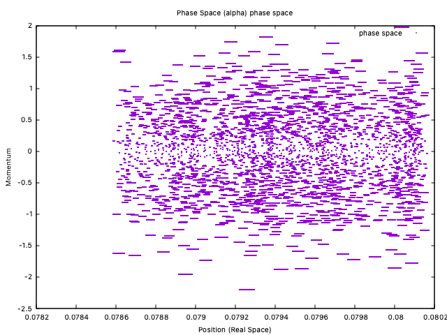
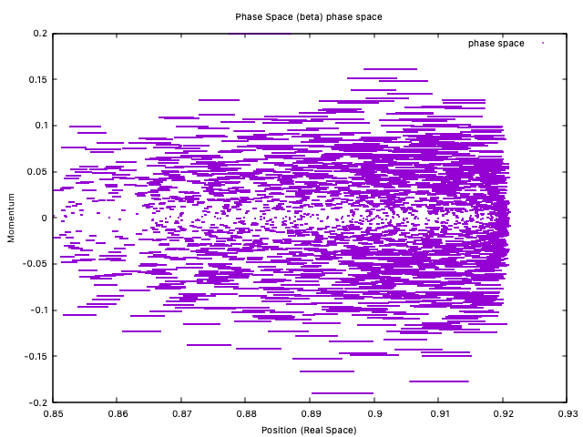

### 1. The Model: GARCH(1,1)
We assume a time series of returns $y_t$. We model them as:
$$y_t = \sigma_t \epsilon_t \quad \text{where} \quad \epsilon_t \sim \mathcal{N}(0, 1)$$

The variance $\sigma_t^2$ evolves according to the GARCH(1,1) recursion:
$$\sigma_t^2 = \omega + \alpha y_{t-1}^2 + \beta \sigma_{t-1}^2$$

**Constraints for Stability:**
- $\omega \gt 0, \alpha \ge 0, \beta \ge 0$ (Positivity)
- $\alpha + \beta \lt 1$ (Stationarity/Mean Reversion)

---

### 2. The Bayesian Objective (Log-Posterior)
In HMC, we don't just want the "best" parameters; we want to sample from the posterior distribution $P(\theta | y)$. By Bayes' Theorem:
$$\log P(\theta | y) = \log P(y | \theta) + \log P(\theta)$$

#### A. The Log-Likelihood $\log P(y | \theta)$
For clarity, we derive the Gaussian case first. The log-likelihood for $T$ observations is:
$$\mathcal{L}(\theta) = -\frac{1}{2} \sum_{t=1}^T \left[ \log(2\pi) + \log(\sigma_t^2) + \frac{y_t^2}{\sigma_t^2} \right]$$
Note that the derivative shown here is specific to the Gaussian assumption. The actual implementation uses a fat-tailed likelihood, which modifies the inner derivative by a scaling factor (but leaves the recursive chain rule structure unchanged).

#### B. The Prior $\log P(\theta)$
A flat prior would be $\log P(\theta) = 0$, but we apply a soft stationarity constraint that penalizes $\alpha + \beta$ approaching 1. This keeps the sampler from wandering into non-stationary regions without requiring hard rejection.

---

### 3. The HMC "Engine" (Hamiltonian Dynamics)
HMC introduces a fake "momentum" variable $p$ for each parameter $\theta$. It simulates a particle sliding on a landscape where the **Potential Energy** is the negative log-posterior:
$$U(\theta) = -\log P(\theta | y)$$

The total energy (Hamiltonian) is:
$$H(\theta, p) = U(\theta) + \frac{1}{2}p^T M^{-1} p$$

To move the particle, we use the **Leapfrog Integrator**. This requires the gradient of the potential energy $\nabla U(\theta)$, which is simply the **gradient of the negative log-posterior**:
$$\nabla U(\theta) = -\nabla \mathcal{L}(\theta)$$

---

### 4. The Gradient Derivation 
Because $\sigma_t^2$ is recursive, we cannot calculate the gradient at time $t$ without knowing the gradient at $t-1$. We must compute these in a single forward loop over our data.

For any parameter $\theta \in \{\omega, \alpha, \beta\}$, the total gradient is:
$$\frac{\partial \mathcal{L}}{\partial \theta} = \sum_{t=1}^T \left( \frac{\partial \mathcal{L}}{\partial \sigma_t^2} \cdot \frac{\partial \sigma_t^2}{\partial \theta} \right)$$

#### Step 1: The "Inner" Derivative
The derivative of the likelihood with respect to the variance at time $t$ (Gaussian case):
$$\frac{\partial \mathcal{L}}{\partial \sigma_t^2} = \frac{y_t^2 - \sigma_t^2}{2(\sigma_t^2)^2}$$

#### Step 2: The "Recursive" Derivatives (The Chain Rule)
We calculate these as we loop through $t=1 \dots T$:

1.  **For $\omega$:** $\frac{\partial \sigma_t^2}{\partial \omega} = 1 + \beta \left( \frac{\partial \sigma_{t-1}^2}{\partial \omega} \right)$
2.  **For $\alpha$:** $\frac{\partial \sigma_t^2}{\partial \alpha} = y_{t-1}^2 + \beta \left( \frac{\partial \sigma_{t-1}^2}{\partial \alpha} \right)$
3.  **For $\beta$:** $\frac{\partial \sigma_t^2}{\partial \beta} = \sigma_{t-1}^2 + \beta \left( \frac{\partial \sigma_{t-1}^2}{\partial \beta} \right)$

*(Initial conditions: All $\frac{\partial \sigma_0^2}{\partial \theta} = 0$)*.

In practice, all four parameters are sampled in **unconstrained log-space** (i.e., $\omega = e^{\phi_\omega}$, etc.) and the Jacobian factor $e^{\phi_i}$ is applied to each gradient component. This keeps the sampler in unconstrained space and naturally enforces positivity.

---

### 5. Baseline: Metropolis-Hastings
It's instructive to walk through a standard Metropolis-Hastings (MH) sampler. The logic maps directly onto the components above:

| Component      | Mathematical Term           |
| :------------- | :-------------------------- |
| **State**      | $\theta$ (Parameters)       |
| **Likelihood** | $\mathcal{L}$               |
| **Gradients**  | $\nabla_\theta \mathcal{L}$ |
| **Dynamics**   | Leapfrog                    |
| **Acceptance** | Metropolis-Hastings         |

### 6. Results

Let's take a look at the results. Starting with final applications.

#### Price

It turns out that the garch(1,1) model is so good - that it will completely hide wrong values for price volatility bands. So, even if interesting - it's not the right plot to look at.

#### Volatility plot 

It also turns out volatility plot is interesting - but almost completely unaffected by wrong input parameters.

#### Posterior distributions

This is a deeper dig into the internal workings of the engine. It partially informs on the results and traces back to the actual simulation run and the Bayesian model.

#### Phase Plots

An explanation is maybe useful here: at the very start of the run, a Max-Likelyhood-Estimate is performed on the parameters - and mass components are computed from the curvature. Those mass components are carried over to enter the definition of the Hamiltonian - and thus, the phase plots have "circles" instead of very flat elipses.

For simplicity of the explanation, the fat tail of the posterior (and related parameter plots) were completely left out from the test and from the illustrations.

### 7. Conclusion
Ultimately, moving from MLE to a Bayesian HMC approach allows us to quantify the uncertainty of our volatility parameters rather than just picking a single point.

While the implementation of a No-UTurn-Sampler is more involved than a simple MH sampler, the resulting stability and convergence speed make it the gold standard for these recursive models. In a high-performance C++ environment, this approach allows for the kind of rapid inference and parameter optimization that is usually prohibitive with traditional Bayesian methods.

## 8. Comments
Questions or suggestions? [Send me an email](mailto:razvan@embedinker.com) 