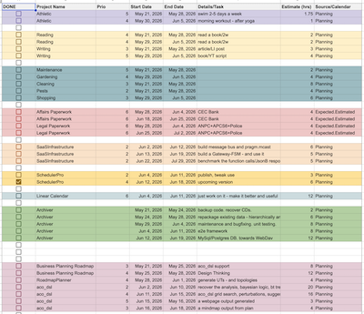
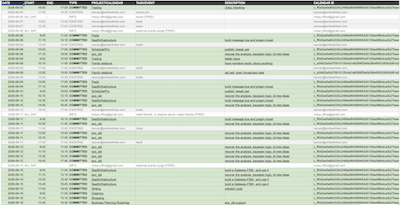

## Problem Statement

Suppose we have busy lives - and some parts are bolted with calendar appointments. And that has nothing to do with growth - but mostly with maintenance. Some growth seeps through - barely to make a dent. Not to mention the sustained effort required to make an idea into a product.
Now, suppose there's 2 hours every day where you could work at the growth part - pushing the project forward, connecting all the disparate parts.

## Proposed solution

Take a spreadsheet - and fill in tasks. 
Then add project titles - grouping the tasks into projects.
Then set a date range where you'd want the tasks done. Then add estimates - smaller than the timespan where the project could live.
Then add priorities.

Then - create multiple calendars for tracking multiple projects - that's highly recommended. At least for parts that can move independently. Why not - assign a calendar in column for each task. Or just use a Planning calendar - that is isolated enough.

Then have a piece of software break them down in deep work blocks - and place in the desired calendar - sorted by priority - and start date.

Then examine them at your own pace - annotate and tweak, delete some. And have the same piece of software - upload them to your calendar - preferably your planning calendar - or project calendar (and not the main calendar).

Then, suppose something is not quite right - or a date is off: you can delete the plan from calendar (hundreds of entries, perhaps), re-run the scheduling with the fixed value - and reapply to the calendar

## Spoiler

This story describes a product we've built - a Round-Robin priority scheduler, now available in the Google Workspace Marketplace. It currently uses Google Sheets™ and Google Calendar™ for its operations (which are great products in themselves) - but we also intend to have a weaker coupled version too.

### See it in action


Demo of SchedulerPro run and operations - 12minutes or so

### Get started

You can find the app in the [Google Workspace Marketplace](https://workspace.google.com/marketplace/app/scheduler_pro/974650517233).

If you are a builder, engineer, or busy creator looking to protect your growth time and want to be one of our first users, please [use the support form](https://schedulerpro.embedinker.com/support-report-issue) [that captures all info needed for enrolement] or email me at **razvan@embedinker.com** to request an invite. I'll add you as a user and waive the first month's payment.

---

Google Workspace™, Google Calendar™, Google Sheets™, Google Account™, Google API™, and Google Security™ are trademarks of Google LLC. SchedulerPro is not affiliated with, endorsed by, or sponsored by Google LLC.